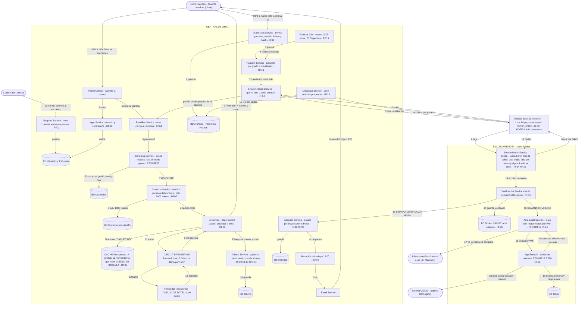

# Diagrama final — RemoteSchooly

Iteración #2 de `Diagrama.excalidraw` en mermaid.

- CUELLO DE BOTELLA: Proveedor IA. Tiene CACHE Respuestas IA y CIRCUIT BREAKER.
- SPOF y CUELLO DE BOTELLA: Enlace Satelital. Tiene descarga por partes y BD Nodo como CACHE de la escuela.

