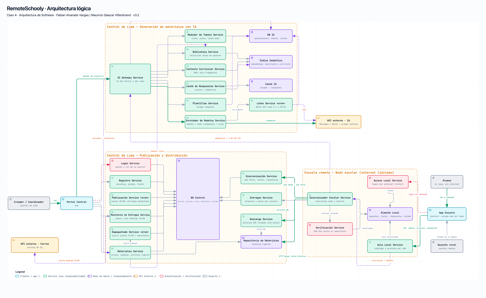

# RemoteSchooly — educación en línea para pueblos remotos del Perú

**Caso de Estudio #4 — Arquitectura de Software, UTEC 2026-II.** Diseño top-down aplicando el framework **R.E.D.A.L.E.** Dificultad: Medium.

**TEAM:** Fabian Alvarado Vargas · Mauricio Salazar Hillenbrand

## Entregables del lab

| Entregable (rúbrica) | Ubicación |
| :--- | :--- |
| **Requerimientos** (3 ptos) | [Requerimientos/Funcionales.md](Requerimientos/Funcionales.md) (RF-01 a RF-26) · [Requerimientos/NoFuncionales.md](Requerimientos/NoFuncionales.md) (RNF-01 a RNF-11), con trazabilidad a personas y a componentes del diagrama |
| **Eval 8/10 PASSED** (2 ptos) | [EVAL/iteracion-1.md](EVAL/iteracion-1.md) (v1: 6,1/10 **FAILED**) → [EVAL/iteracion-2.md](EVAL/iteracion-2.md) (v2: 9,3/10 **PASSED**) → [EVAL/iteracion-3.md](EVAL/iteracion-3.md) (v3: 10,0/10 **PASSED**, sin ajustes del juez). Agentes-persona, juez y rúbrica en [Agents/](Agents/) |
| **Diagrama de arquitectura** (10 ptos) | [Diagramas/arquitectura.pdf](Diagramas/arquitectura.pdf) · [PNG](Diagramas/arquitectura.png) · [HTML interactivo](Diagramas/arquitectura.html); explicación y trazabilidad en [REDALE/5-Listar-componentes.md](REDALE/5-Listar-componentes.md) |
| **Happy paths se cumplen en el diagrama** (5 ptos) | Mismo diagrama con cada camino resaltado: [HP1 distribución](Diagramas/arquitectura-hp1.pdf) · [HP2 IA −40 %](Diagramas/arquitectura-hp2.pdf); secuencias paso a paso: [happy-path-1-distribucion.pdf](Diagramas/happy-path-1-distribucion.pdf) · [happy-path-2-generacion-ia.pdf](Diagramas/happy-path-2-generacion-ia.pdf) |

**Versión actual: v3.2.** Correcciones de cierre en [EVAL/revision-final.md](EVAL/revision-final.md). El 10,0/10 documentado corresponde a v3; no se ha ejecutado una nueva evaluación por personas para v3.2.

## Definición del problema

El gobierno del Perú nos encarga la plataforma que lleva educación en línea a pueblos remotos. Hay dos problemas distintos:

1. **Los materiales no llegan bien.** La central de Lima produce cada semana el material de todos los cursos y grados, pero en las escuelas remotas el internet es satelital, lento (1–4 Mbps), compartido y disponible solo algunas horas; en las casas no hay internet. Hoy cada docente y cada alumno descarga por su cuenta: las descargas se cortan y reinician, los archivos llegan incompletos o dañados y nadie sabe si tiene la semana completa. El profesor no puede dar clase con seguridad y el alumno no puede estudiar en casa.
2. **La IA cuesta demasiado.** Los docentes creadores de la central generan los materiales con la IA integrada en la plataforma: pegan documentos completos como contexto, piden varias versiones y regeneran lo que un colega ya hizo. El gobierno exige reducir el gasto en tokens **al menos 40 %** sin dejar de producir el material semanal.

El enunciado aclara que **no** se exige 100 % de disponibilidad ni mecanismos de reliability en esta etapa, pero **sí** que los cursos lleguen correctamente.

## Alcance

| Qué SÍ cubre el sistema | Qué NO cubre (en esta etapa) |
| :--- | :--- |
| Generación y adaptación de materiales con IA desde plantillas, con reutilización, caché, modelos y modos según la tarea, y medición de tokens frente a un presupuesto | Alta disponibilidad, réplicas, failover o reintentos sofisticados del servidor (el enunciado los excluye) |
| Publicación de un paquete semanal por grado, con manifiesto y hash por archivo | Videoconferencia o clases en vivo |
| Distribución a un **nodo escolar** por escuela: descarga única, diferencial y reanudable, con verificación de integridad y acuse | Calificación automática de las respuestas |
| Acceso de alumnos y docentes por la red local de la escuela, y estudio y respuesta **sin internet** en casa | Compra, instalación y energía del equipo del nodo escolar (se asume una laptop o mini-PC por escuela) |
| Panel de estado de entrega por escuela y alerta de escuelas incompletas | Reportes al ministerio más allá del panel |

## Usuarios y stakeholders

**Usuarios** (usan el sistema todos los días; definiciones con pain points en [Personas/](Personas/)):

- **[Yesenia](Personas/yesenia.md)** — alumna de 2.º de secundaria en Ocongate (Cusco); sin internet en casa; tablet prestada por la escuela. Necesita abrir en casa, sin internet, la semana completa y responder ejercicios sin conexión.
- **[Julián](Personas/julian.md)** — docente multigrado en el río Marañón (Loreto); la antena satelital de la escuela es el único enlace del pueblo. Necesita que el paquete llegue solo, completo y verificado antes del lunes, y adaptar materiales con IA desde la escuela.
- **[Rocío](Personas/rocio.md)** — docente creadora de contenido en la central de Lima. Necesita generar con plantillas, reutilizar lo que ya existe, ver cuánto gasta en tokens y saber qué escuelas recibieron el paquete.

**Stakeholder** (no usuario diario): el gobierno del Perú, que financia la plataforma y fija la meta del −40 % en tokens; entra al diseño como requerimiento no funcional (RNF-01).

## Supuestos

- Piloto de 5 000 escuelas remotas, 150 000 alumnos, 12 000 docentes rurales y 60 docentes creadores; 11 grados con paquete semanal; una escuela típica atiende 6.
- Cada escuela cuenta con una laptop o mini-PC que actúa como **nodo escolar** y con una red WiFi local; las tablets de los alumnos son Android con ≤ 1 GB libre para la plataforma.
- El proveedor de IA ofrece generación inmediata, una API por lotes con 50 % de descuento y caché de prefijos de prompt (como los proveedores actuales).
- Precios de referencia para la estimación: US$ 3 / millón de tokens de entrada y US$ 15 / millón de salida en el modelo estándar.

---

### Framework R.E.D.A.L.E.

| Paso | Documento |
| :--- | :--- |
| **R** — Requerimientos | [REDALE/1-Requerimientos.md](REDALE/1-Requerimientos.md) (problema, para quién, limitaciones) + [Requerimientos/](Requerimientos/) |
| **E** — Estimar | [REDALE/2-Estimar.md](REDALE/2-Estimar.md): servidores (≈ 24 RPS pico → 1 servidor de 8 cores), almacenamiento (≈ 200 GB/año), ancho de banda (2,7 TB/semana; 37 min por escuela a 2 Mbps) y **cálculo del −40 % en tokens** (línea base US$ 702/semana → US$ 164 con los cuatro mecanismos en cascada) |
| **D** — Diseñar el servicio | [REDALE/3-Disenar-el-servicio.md](REDALE/3-Disenar-el-servicio.md): monolito modular 3-tier en Lima + nodo escolar offline-first, SQL / object storage / índice vectorial, API REST, y las dos cadenas de diseño (paquete verificado y AI Gateway) |
| **A** — Armar el modelo de datos | [REDALE/4-Armar-modelo-de-datos.md](REDALE/4-Armar-modelo-de-datos.md) |
| **L** — Listar los componentes | [REDALE/5-Listar-componentes.md](REDALE/5-Listar-componentes.md): diagrama, tabla requerimiento → componente, building blocks usados y los dos happy paths sobre el diagrama |
| **E** — Escalar | No se aplica en este lab (indicación del curso); ver nota al final de 5-Listar-componentes.md |

## La arquitectura en una imagen

Tres zonas y una API externa: **Central de Lima — Generación con IA** (el AI Gateway es el único punto de acceso a la IA y ejecuta los mecanismos de ahorro de menor a mayor costo), **Central de Lima — Publicación y distribución** (paquete por grado con manifiesto SHA-256, publicación el jueves, servicios de sincronización, descarga por rangos y entregas) y **Escuela remota — Nodo escolar** (descarga una sola vez cuando hay señal, verifica, y sirve por la red local a la App Escuela, que funciona sin internet en casa). Las dependencias externas son **Proveedor de IA** y **API de correo** (RF-26).

## Iteraciones del diseño

| | Iteración 1 | Hallazgo | Iteración 2 |
| :--- | :--- | :--- | :--- |
| Requerimientos | v1: 15 RF + 8 RNF, escritos desde el sistema | **EVAL 6,1/10 — FAILED** ([iteracion-1](EVAL/iteracion-1.md)): la alumna no podía responder sin conexión ni ver qué semana tenía; el docente rural no podía adaptar con IA ni sabía cuándo llegaría el paquete; el alumno no podía autenticarse sin internet; nadie fijaba el presupuesto de tokens | v2: 26 RF + 11 RNF; login sin internet contra el roster, respuestas sin conexión con envío automático, estado en la tablet, adaptación desde la escuela, plazo jueves → lunes 07:00, presupuesto y línea base → **EVAL 9,3/10 — PASSED** ([iteracion-2](EVAL/iteracion-2.md)). v3: los 11 refinamientos del juez (cierre de semana, cuestionarios respondibles, cuota escolar, biblioteca explorable, alerta activa) → **EVAL 10,0/10 — PASSED** ([iteracion-3](EVAL/iteracion-3.md)) |
| Arquitectura | Panel de tres propuestas independientes (offline-first, cost-first, mínima estilo entrevista) juzgadas por rúbrica del profesor y credibilidad técnica | Contradicción alumno–login, un mismo service con dos responsabilidades (publicar y monitorear; sincronizar y servir bytes), ambos happy paths pintados sobre el mismo diagrama no discriminan nada | Síntesis: 21 services de responsabilidad única, Acceso Local en el nodo, Publicación / Monitoreo y Sincronización / Descarga / Entregas separados, un diagrama por happy path resaltado |
| Estimación | Límite de 300 MB por grado; estimación ≈ 220 MB con video largo | Con 6 grados y 1–2 Mbps la escuela necesitaba más de una ventana de señal | Variante ligera ≤ 100 MB por grado (video solo corto): 37 min a 2 Mbps; una sola descarga por escuela |

## Cómo se produjeron los diagramas

Los diagramas se escribieron como JSON tipado y se compilaron con [archify](https://github.com/tt-a1i/archify) (validación de esquema y revisión visual de la composición). Los HTML son interactivos: permiten buscar componentes, seguir las *guided views* de cada happy path y exportar. Los PDF y PNG se exportaron en tema claro para su entrega.

La regeneración y verificación son reproducibles con los scripts y pasos de [tools/README.md](tools/README.md).
